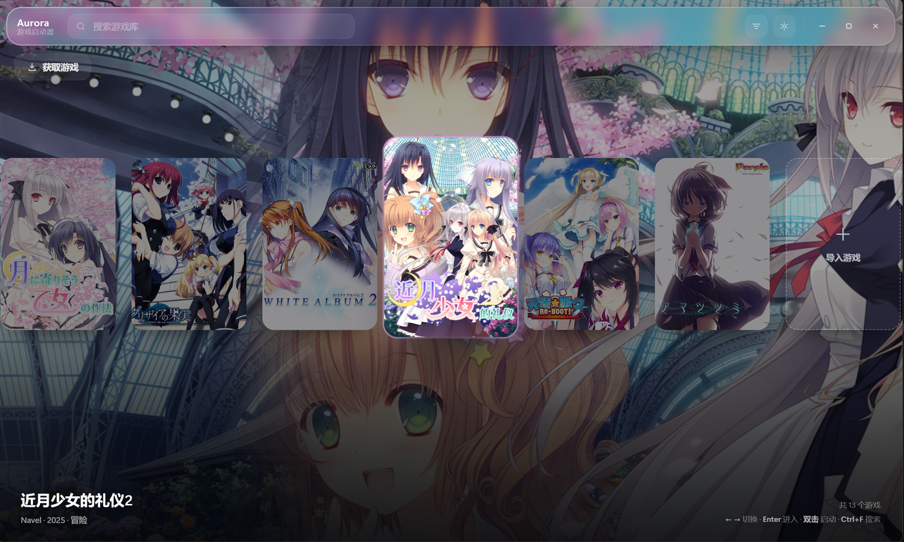
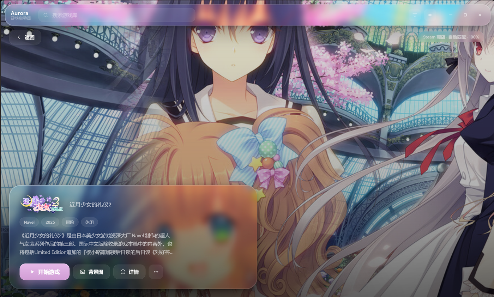

# Aurora 游戏启动器

一个极简、毛玻璃质感的本地游戏启动器。导入任意 `.exe`，它会用**可执行文件名**或**所在文件夹名**自动去 Steam 商店匹配游戏简介、封面与多张背景图，你可以随时在壁纸之间切换。

主界面是 **NS 大厅式的大封面横滑**：焦点封面会放大，背景同步淡入该游戏的壁纸；单击进入游戏页，双击直接开玩。
工具条上可以在 **主页** 与 **分类** 两屏之间切换：分类屏负责自建分类、游玩状态、按开发商筛选与批量整理。

内置 VNDB / Bangumi 多源兜底与简介翻译，支持用本机 Locale Emulator **转区启动**日文原版，网络连不上时可以在设置里一键诊断。

### 大厅



- 一屏大约 7 张封面，焦点那张放大上浮并带强调色描边，其余压暗；**背景就是焦点游戏的壁纸**（缓慢缩放）。
- `←` `→` / 滚轮 / 横向拖动都能切换，`Enter` 进入游戏页，**双击直接启动**，`Ctrl+F` 搜索；鼠标悬停 0.3 秒也会自动聚焦。
- 左上角是 **获取游戏** 入口；行末尾的虚线方块用来「导入本地游戏」或「获取游戏」；
  底部信息带显示当前游戏的开发商 · 年份 · 类型、游戏总数与快捷键提示。

### 游戏页



- 单击封面进入：壁纸铺满整屏，左下角卡片是 LOGO、标题、类型标签、简介与「开始游戏 / 背景图 / 详情 / ⋯」。
- 右上角显示资料来源与匹配度（图中为「Steam 商店 · 自动匹配 · 100%」），游戏运行时这里会变成实时计时。
- 左上角「← 返回」或 `Esc` 回大厅；在游戏页按 `←` `→` 也能直接换游戏。

> 两张图都是实际运行截图，壁纸、封面与简介来自资料源联网匹配的结果。

---

## 快速开始

**方式一（推荐）：双击 `Aurora.exe`**

根目录的 `Aurora.exe` 是打包好的单文件程序，**不需要安装 Python**，拷到任何地方都能跑。
首次启动会解压到临时目录，大约 3–5 秒，之后启动更快。数据保存在 exe 同目录的 `data\` 下，整个文件夹可以直接搬到 U 盘里带走。

**方式二：双击 `启动 Aurora.bat`**

用系统里的 Python 运行源码（首次会自动检查并安装 `pywebview`）。

然后：

1. 点左下角 **导入游戏** 选一个 `.exe` / `.bat`（可以多选），或者直接把 `.exe` / 整个游戏文件夹**拖进窗口**。
2. 程序会自动联网匹配，几秒后出现简介、封面与壁纸。
3. 点 **开始游戏** 运行，点 **背景图** 挑一张你喜欢的壁纸（还能缩放平移）。

> 拖文件夹时会向下找最多 3 层（`游戏名\Game\xxx.exe` 这类结构也能识别），
> 自动跳过 `Redist`、`DirectX` 等杂项目录和 `unins000.exe`、`setup.exe` 之类的安装器，
> 单次最多导入 40 个；非 exe 文件会被忽略并提示。
> `.bat` / `.cmd` 启动器会经 `cmd.exe` 拉起，同样能统计时长、也能「结束游戏」。

> 命令行方式：`python main.py`；调试：`调试启动.bat`（保留控制台）。

**方式三：自己打包成 exe**

双击 **`打包 Aurora.bat`**：它会自动找到 Python、缺依赖时装 `pywebview`、
首次运行时把 PyInstaller 装进 `_build\venv`（需要联网，几分钟），然后调用
`tools\build_exe.py` 打包，最后把结果覆盖到根目录的 `Aurora.exe`。
改了源码或界面之后重新跑一次这个脚本，`Aurora.exe` 就是最新的。
（不想用脚本也可以直接跑 `python tools\build_exe.py`。）

### 环境要求

| 项目 | 要求 |
| --- | --- |
| 系统 | Windows 10 / 11（推荐 Win11，圆角由系统 DWM 提供） |
| 运行 `Aurora.exe` | 无额外依赖 |
| 运行源码 | Python 3.9+（Anaconda 亦可）+ `pywebview >= 5.0` |
| 内核 | Edge WebView2 Runtime（Win11 自带；Win10 若缺失会自动回退 Qt 内核） |
| 联网 | 仅用于查询公开资料接口，可离线使用（离线时只能手动选本地图片） |

---

## 它是怎么找到游戏信息的

```
exe 路径 → 推断候选关键词 → 依次查询各资料源 → 相似度打分 → 详情 + 图片
                              ↑ Steam / VNDB / Bangumi / 自定义源
```

### 资料源

内置三个**免费、无需 API Key** 的源，从上到下依次尝试，命中即用：

| 源 | 适合 | 能拿到 |
| --- | --- | --- |
| **Steam 商店** | 上架 Steam 的游戏 | 中文简介、开发商、官方 LOGO、hero 大图、全部截图 |
| **VNDB** | galgame / 视觉小说（Steam 上没有的也能找到） | 原文名 + **中文名** + 英文名、封面、**多张截图**、开发商、发售日、VNDB 评分 |
| **Bangumi 番组计划** | 中文资料 | 中文名、中文简介（部分 R18 条目受限于接口只给名字与封面）、封面 |

- 每个源都会把**所有已知名称**（中文名 / 日文原名 / 英文名）拿去打分，所以文件夹叫 `サノバウィッチ`、`魔女的夜宴` 还是 `Sabbat of the Witch` 都能命中同一个条目。
- 打分综合：完全一致 > 前缀包含 > 子串包含 > 词元重合 > 编辑距离，并对长度差异做惩罚；「原声带 / DLC / 试玩版」这类非本体条目会降权。
- **只命中次要关键词时要求更严**：目录名恰好叫 `sandbox` 这类通用词时，不会因为「The Sandbox」词元全中就被误配。
- 命中主源后，如果其它源也**高度匹配**同一个游戏（≥0.95），会把它们的图片一并汇总去重（可在设置里关闭「多源补图」）。
- 都匹配不上时不会硬猜：弹出候选列表（标注来源），也可以自己输入关键词重搜。

### 增删与自定义资料源

设置（右上角齿轮）→ **管理资料源…**：

- 每个源都能**开关**、用 ▲▼ **调序**（顺序即优先级）、点「测试」现场验证可用性。
- **添加自定义源**支持两种形态：
  1. **JSON 接口源** —— 填搜索地址模板（`{query}` 占位）+ 字段映射，例如：
     ```json
     {
       "name": "我的资料站",
       "kind": "api",
       "search_url": "https://example.com/api/search?q={query}",
       "results_path": "data.list",
       "fields": {
         "id": "id",
         "name": "name_cn||name",
         "description": "summary",
         "cover": "images.large",
         "screenshots": "screenshots[*].url",
         "developers": "developers[*].name",
         "release_date": "date",
         "url": "url"
       }
     }
     ```
     路径支持 `a.b`、`a[0].b`、`a[*].b`，`||` 表示依次回退。
  2. **跳转型源** —— 只填搜索地址（如 `https://www.touchgal.ink/search?query={query}`），
     它不出现在自动匹配里，而是在候选面板顶部生成一个「在 XXX 搜索」按钮，点一下用浏览器打开。

> 为什么不做 TouchGal 的爬取：`touchgal.ink` 整站挂在 Cloudflare 人机验证后（直接请求返回 403），
> 迁移后的 `kungal.com` 虽然可访问，但其 `robots.txt` 明确 `Disallow: /api`。
> 所以按「跳转型源」接入 —— 既尊重站点规则，又能在需要时一键打开搜索页。

**关键词推断**（`gl/detect.py`）
按可信度排序，优先取最能代表游戏名的那一个：

| 路径 | 推断结果 |
| --- | --- |
| `…\steamapps\common\ELDEN RING\Game\eldenring.exe` | `ELDEN RING`（steamapps/common 后的目录名最可信） |
| `…\Cyberpunk 2077\bin\x64\Cyberpunk2077.exe` | `Cyberpunk2077` → `Cyberpunk` |
| `…\Black Myth Wukong\b1\Binaries\Win64\b1-Win64-Shipping.exe` | `Black Myth Wukong`（`b1` 这类短代号会被降权） |
| `…\Games\黑神话悟空\b1\b1.exe` | `黑神话悟空` |
| `…\The Witcher 3 Wild Hunt\bin\x64\witcher3.exe` | `witcher3` |

处理细节：剥离 `.exe`、`-Win64-Shipping`、`_Data`、版本号、括号内容，拆分 camelCase / PascalCase，跳过 `bin / Win64 / x64 / crack / repack` 等通用目录。

**背景图候选**（每款游戏通常 10–30 张）
- Steam：`library_hero.jpg` / `library_hero_blur.jpg` / `page_bg_generated_v6b.jpg` / 截图
- VNDB：封面 + 全部截图
- Bangumi：封面
- 还可以点「从本地选择图片…」用你自己的壁纸

**图片加载的回退链**（`gl/sources/steam.py` + `app.js`）
- 封面按 `library_600x900 → capsule_616x353 → header → … → 接口地址` 的顺序逐个尝试，某一张 404 就自动换下一张，全部失败才显示首字母占位。
- 缩略图加载失败会自动改用原图；原图也失败时显示「无法预览」而不是空白。
- 图片探测结果中**成功缓存 21 天、失败只缓存 3 小时**，避免一次网络抖动就把某张图长期判成"不存在"。

结果缓存到 `data/cache/steam/<源名>/`（搜索 7 天、详情 30 天）。

---

## 界面与交互

- **NS 大厅**：主界面是一条横滑的大封面（一屏约 7 张），焦点那张放大、上浮并高亮，其余压暗；背景同步换成焦点游戏的壁纸。
  `←` `→`、滚轮、横向拖动都能切换，末尾还有一个「＋ 导入游戏」色块。
- **游戏页**：单击封面进入，壁纸铺满整屏，左下角是 LOGO / 标题 / 简介与按钮；左上角「← 返回」或 `Esc` 回大厅，
  在游戏页里按 `←` `→` 仍然可以直接换游戏。
- **打开方式**：单击 = 进入游戏页看简介，双击 = 直接启动；空库时显示导入引导卡片。
- **毛玻璃**：面板用 `backdrop-filter: blur(30px) saturate(190%)` 模糊身后的壁纸，配 1px 高光描边、内阴影与柔和投影，壁纸会缓慢缩放（Ken Burns），切换背景时交叉淡入淡出。
- **背景缩放**：背景面板底部有缩放滑杆（100%–300%）和「复位」按钮，每款游戏的缩放分别记住。
- **无边框窗口**：调用 DWM 的圆角 / 暗色边框 / 投影，并接管拖拽与八向缩放（`gl/winapi.py` + `app.js`）。窗口拖动请用顶部工具条或大厅底部信息带。
- **设置**：右上角齿轮打开的是**整页设置**（外观 / 资料源 / 简介翻译 / 网络 / 转区启动 / 关于 六个页签），主题模式、配色预设、毛玻璃强度、背景暗化、强调色、玻璃饱和度、Ken Burns 都在「外观」里，改动实时生效。详见 [设置界面](#设置界面)。
- **分类**：齿轮左边是 **主页 / 分类** 切换，分类屏负责自建分类、状态、开发商筛选与批量整理。详见 [分类工作区](#分类工作区主页--分类)。
- **搜索与排序**：顶部搜索框实时过滤大厅；工具条上的排序图标可切换 默认 / 收藏优先 / 名称 / 最近玩过 / 时长，排序结果直接反映在大厅里。
- **收藏**：点「⋯ → 加入收藏」，列表里会显示金色星标；排序切到「收藏」时收藏的游戏排最前。
- **重命名**：点「⋯ → 重命名…」可以给游戏换个显示名（只改启动器里显示的名字）。改过之后重新匹配也不会被覆盖，
  想回到自动命名点「⋯ → 恢复自动命名」即可。
- **换封面**：点「⋯ → 更换封面…」能从该游戏已有的封面候选里挑一张，也可以「从本地选择图片」；
  列表封面和选中时窗口/任务栏图标旁的显示都会跟着变。
- **自定义图标**：点「⋯ → 设置自定义图标…」可以给任意游戏换一张图标（PNG / JPG / WEBP / ICO / BMP 都行）。**焦点停在它上面时窗口与任务栏图标也会一起变成它**；「恢复默认图标」可以撤销。素材原图存在 `data/icons/`，换了电脑也不会丢。
- **更多菜单**：加入/取消收藏、设置自定义图标、打开所在文件夹、设置启动参数、**转区启动…**、重新搜索、翻译简介、打开商店页面、从库中移除（**只移除记录，不删文件**，同时清掉该游戏留下的自定义图标与本地背景图副本）。
- 运行中的游戏会在封面右上角显示绿色圆点，「开始游戏」变成「结束游戏」，结束后自动累计游玩时长；收藏是金星、开了转区是蓝色 `JP`、文件丢失是红色感叹号、正在联网搜索时封面外圈会呼吸。
- **时长不会因为先关启动器而丢**：运行期间每 30 秒把「游戏还活着」写一次盘，下次启动时游戏若仍在运行会直接接管（界面照常显示「运行中」，结束时照常累计），已经结束的就按最后一次心跳补记。
- **重复启动**：再次双击 exe 不会开出第二个窗口，而是把已在运行的窗口还原并置前。
- **运行中详情**：信息卡上会出现「运行中 · 00:35」这样的实时计时；「详情」里还能看到 PID、本次运行时长、**启动次数与最近 5 次会话记录**。
- **截图墙**：详情面板底部列出该游戏的截图，点一张就能设为背景。
- **启动参数**：设置参数时下方有常用参数（`-windowed` / `-dx11` / `-novid` …）可以直接点，参数按游戏分别记住。
- **快捷键**：`←` `→` 换游戏、`Home` / `End` 跳首尾、`Enter` 进入（大厅）或启动/结束（游戏页）、`Esc` 关面板 → 返回大厅、`Ctrl+F` 搜索（设置 → 关于 里也写了）。
- **Steam 库一键导入**：设置 → 资料源 → **扫描 Steam 游戏库…** 读取本机 Steam 清单（含 `libraryfolders.vdf` 里的其它库盘），
  列出所有游戏并自动勾选还没导入的；导入时直接用 Steam 的 appid 取资料，不靠猜名字，因此中文简介一次到位。
- **库的备份与迁移**：设置 → 关于 → **导出游戏库…** 存一份 JSON；换机器后用 **导入游戏库…** 合并回来（按 exe 路径去重，
  已有的条目不会被覆盖）。
- **批量重抓**：设置 → 资料源 → **重新抓取全部信息**，按顺序把库里每个游戏重新搜一遍（进度显示在按钮右侧，过程中不会弹面板打断你）。
- **简介翻译**：各资料源的简介语言不统一（VNDB 只有英文），Aurora 会把**非中文简介自动翻成简体中文**——
  导入并识别后自动翻译；也可以在设置 → 简介翻译 → **翻译全部简介** 批量翻译，或在「⋯ → 翻译简介」单独重译。
  默认走 LLM 接口（DeepSeek，需在 设置 → **简介翻译** 里填 API Key），没填 Key 时自动回退到免费接口。
  **原文会保留**，卡片简介下方可一键「显示原文 / 显示译文」。
- **关闭到托盘**：设置 → 外观里打开「关闭到托盘」后，点右上角 ✕ 会缩到任务栏通知区继续后台运行（左键唤回，右键「显示 / 退出」），
  游戏不会被中断；不开这个选项时 ✕ 就是退出。
- **获取游戏**：大厅左上角 **获取游戏**，或滑到最右边的「＋」方块选「获取游戏…」，打开这个面板：
  - **资源站（可自己增删）**：默认给了 itch.io 免费视觉小说 / kungal / DLsite 三个入口，点名字就用**系统默认浏览器**打开；
    「＋ 添加站点」可以加任意站点，地址里带 `{query}` 时会把你填的关键词拼进去（例如
    `https://example.com/search?query={query}`）；每个站点右侧的 `×` 可以删掉它。
  - **下载目录监听**：指定一个下载目录（默认 `data\downloads`），**下载完 / 解压完自动进库**——新出现的游戏文件夹、
    直接放的 exe 都会被识别；压缩包自动解压（`.zip` 内置，`.rar/.7z` 用本机的 7-Zip / WinRAR），
    解压到同名文件夹且**不删除压缩包**；换目录会重新建基线，不会把目录里的旧文件一口气导进来。
  - 一句话流程：**在浏览器里挑、下到那个目录，剩下的交给 Aurora**（不在浏览器里登录什么、下什么，都由你自己决定）。

### 设置界面

右上角齿轮打开的是**整页设置**（不再是弹层），左侧六个页签：

| 页签 | 里面有什么 |
| --- | --- |
| 外观 | 毛玻璃强度、背景暗化、强调色、玻璃饱和度、Ken Burns 缓慢缩放、关闭到托盘 |
| 资料源 | 简介语言、多源补图、管理资料源…、扫描 Steam 游戏库…、重新抓取全部信息 |
| 简介翻译 | 自动翻译开关、翻译方式（自动 / 仅 LLM / 仅免费）、接口地址、API Key、模型、显示原文、测试接口、翻译全部简介 |
| 网络 | 代理模式（自动 / 直连 / 手动）、代理地址、失败自动换路、一键测试五个端点 |
| 转区启动 | 新游戏默认转区、LEProc.exe 路径（可手动指定）、打开下载页、重新检测、读到的 LE 全局配置 |
| 关于 | 版本、数据目录、打开数据目录、导出 / 导入游戏库、快捷键说明 |

改动立刻生效并写进 `data\library.json`；按 `Esc`、点左上角「← 返回」，或再点一次齿轮都能回到进来前那一屏（大厅或游戏页），焦点仍停在原来的游戏上。
设置页是**独立界面**：里面的滚轮只滚动设置内容，`←` `→`、`Enter`、`Home` / `End` 都不会穿透去切封面或启动游戏；工具栏只留窗口按钮与齿轮，搜索框和排序收起来，免得改到看不见的大厅状态。

### 转区启动（Locale Emulator）

日文原版 galgame 在中文系统上常出现乱码或路径报错，转区可以解决。

- **只对接本机已装的 LE**：Aurora 不下载任何第三方程序。设置 → 转区启动 会探测 `Program Files`、`LocalAppData`、各盘常见目录与 `PATH`；没装就点「打开下载页」自己去装，或点「指定 LEProc.exe…」手动指路——选完会检查 `LEProc.exe`、`LECommonLibrary.dll`、`LoaderDll.dll`、`LocaleEmulator.dll` 四件套是否齐，缺文件直接拒绝。
- **按游戏开关**：大厅或游戏页的「⋯ → 转区启动…」里单独为某个游戏开启，并从 LE 的 `LEConfig.xml` 里挑一套全局配置（不挑就用 LE 的默认配置）。开了转区的游戏封面右上角有蓝色 `JP`，游戏页信息条上也会写「转区启动」。
- **实际命令**：`LEProc.exe -runas <GUID> <游戏 exe> [启动参数]`；没选配置时是 `LEProc.exe -run <游戏 exe> [启动参数]`。
- **兜底不拦人**：本机没装 LE，或目标不是 exe、不是 32 位（LE 只支持 32 位目标）时，**照常按普通方式启动**，只在右下角提示一句。
- **时长仍然准**：转区是 `LEProc.exe` 拉起的，真正的游戏是它的子进程。Aurora 按进程树认本体（`gl/proctree.py`），所以引导进程退出后不会误判成「游戏已结束」，时长与启动次数照常入账。

### 网络诊断

资料源偶发连不上时不用猜：

- **生效路线写清楚**：设置 → 网络顶部直接写「当前生效：`http://127.0.0.1:7897`（来源：Windows 系统代理）」。解析顺序是 手动 → 环境变量 → Windows 系统代理（注册表）→ 直连。
- **一键测试**：点「测试资料源」逐个试 Steam 商店、Steam 图片、VNDB、Bangumi、翻译接口，五条结果带耗时，谁不通一眼看出来。
- **手动覆盖**：代理模式可选 自动（跟随系统与环境变量）/ 直连 / 手动；手动填 `http://127.0.0.1:7897` 这类地址即可（不写协议会自动补 `http://`）。
- **失败自动换路**：走代理失败时按设置再试一次**直连**（默认开），代理规则坏掉时能自救。
- **图片走系统代理**：封面 / 背景图是界面（WebView2）自己加载的，不受启动器代理设置影响。所以「资料搜到了但封面出不来」时，Aurora 会在右下角提醒一次到设置 → 网络 里测连通性。

### 分类工作区（主页 / 分类）

工具条上、设置齿轮左边是 **主页 / 分类** 两屏切换（书架屏以后再补）：

- **左栏目录**：全部游戏（N）→ 未分类（N）→ **已收藏（N）** → 自定义分类（＋ 新建，选中的分类可以上移 / 下移 / 重命名 / 删除）→ 按状态（在玩 / 通关 / 搁置 / 未标记）→ 按开发商（按数量排序，超过 12 个可展开）。底部写明「一部游戏可以放进多个分类；删除分类只解绑，不动游戏与记录」。
- **右栏海报墙**：当前范围里的游戏网格，单击封面直接弹出详情面板（顺手就能改状态），搜索框与排序和主页共用同一份状态，两处永远一致。
- **批量归类**：点「批量归类」进入整理模式，点封面勾选（右下角出现对勾），底栏可以「全选当前结果 / 选目标分类 / 加入分类 / 移出当前分类 / 收藏 / 取消收藏」；归类后停留在原地方便接着整理。
- **作用域会带回主页**：在左栏选「柚子社」这类范围后回主页，大厅只滑这一类。
- **主页也能直接选**：左上角「全部游戏 · 15」按钮点开就是作用域菜单——全部 / 未分类 / **已收藏** / 自定义分类 / 按状态 / 按开发商，选完即生效；右侧的 × 一键回到全部。作用域会被记住（`localStorage`）。
- **状态徽标**：在玩（绿「玩」）、通关（蓝「通」）、搁置（灰「搁」）会显示在封面右上角，和运行中、收藏、`JP`、文件丢失徽标并排；状态在详情面板里改。

### 主题与配色

设置 → 外观里有两组新选项：

- **主题模式**：深色 / 浅色 / **跟随系统**（读 Windows 的「应用模式」，切换时会实时跟着变）。窗口外框（DWM 暗色模式与描边）也会一起切换。
- **配色预设**：极光蓝（默认）、薄荷青、樱花粉、琥珀橙；点「强调色」自己挑颜色时自动变成「自定义」。
- 实现上把界面里所有白色半透明都抽成了 `--srf / --fil / --ln` 令牌：**深色主题的取值与改造前完全一致**，浅色主题整组覆盖成「白色面纱 + 墨色描边」，毛玻璃、暗化、饱和度三个滑杆仍然由你自己调。
- 浅色主题下背景壁纸会**提亮**（压暗方向翻转，暗化滑杆仍可调），大厅底部文字因此清晰；非焦点封面仍然**压暗**而不是被洗白，焦点封面更突出。

### 游戏内翻译（日文原版也能玩）

日文原版的视觉小说可以直接在 Aurora 里开翻译，译文显示在游戏上的悬浮窗里：

- **两种文本源**：优先对接本机已装的 **TextractorCLI**（拿的是游戏里的真实文本，最准）；没装就用**屏幕 OCR**（截取你框选的对话框区域 → Windows 自带 OCR 识别）。启动器会根据游戏本体 PID 自动 `attach`，不用手选进程；面板里能看线程列表、手动锁定线程或粘贴 hook 码。
- **流式译文**：走你已经在「简介翻译」里配好的 LLM 接口，逐字吐译文；带**上下文**（默认前 4 句，保证人称语气连贯）与**术语表**（`data/glossary.json`，全局 + 每作品两级，人名固定译法）。重复台词走缓存，秒出。没配 Key 也能用免费接口，但界面会提示质量与速度较差。
- **悬浮窗**：透明置顶小窗，默认**鼠标穿透**不挡游戏；`Ctrl+Alt+T` 切换穿透/可拖拽，`Ctrl+Alt+Y` 显示隐藏；支持仅译文/双语、字号与不透明度调节，位置尺寸会记住。游戏退出时自动停止并收起。
- **入口**：游戏页「翻译」按钮打开状态面板（开关、引擎、PID、线程、hook 码、重译、框选 OCR 区域、最近译文）；设置 → **游戏内翻译** 页签管引擎、TextractorCLI 路径、OCR 组件状态、上下文句数、术语表与悬浮窗样式。
- **位数自动匹配**：Textractor 压缩包里根目录是 x86 版、`x64\` 是 64 位版；注入 32 位游戏（galgame 绝大多数）必须用 x86 那份。Aurora 会读游戏 exe 的 PE 头判断位数，自动挑对应版本；设置页把检测到的各版本都列成一行胶囊（带位数），点一下即可切换。若你手动指定了位数不符的那一份，开启时会明确提示「这个游戏是 32 位，当前的 CLI 是 64 位」。
- **前置条件**：Textractor 需要你自己安装（启动器只对接、不打包不代下，与 Locale Emulator 一样）；OCR 模式需要系统装「日语 OCR」组件（设置 → 时间和语言 → 语言和区域 → 添加日语 → 勾选光学字符识别），面板里有一键跳转。独占全屏的游戏建议改成窗口化/无边框，否则可能抓不到画面。

### 程序图标

`Aurora.exe` 的图标由 `tools/make_icon.py` 生成：极光渐变（青→蓝→靛→紫）圆角方块 + 玻璃高光 + 圆角播放三角，一次性输出 7 种尺寸（256→16px）打进 `.ico`，小尺寸下也不会糊。

想换成自己的图标：改 `tools/make_icon.py` 的配色/形状后重新生成，再跑 `python tools\build_exe.py` 重新打包即可。

---

## 目录结构

```
v4.1/
├─ Aurora.exe             打包好的单文件程序（双击即用，无需 Python）
├─ 启动 Aurora.bat        用系统 Python 运行源码（自动装依赖、无控制台）
├─ 调试启动.bat           带控制台的调试模式
├─ 打包 Aurora.bat        一键打包成 Aurora.exe（自动准备依赖 + PyInstaller）
├─ main.py                入口：创建窗口、应用 DWM 效果、启动内核
├─ docs/images/           README 里的界面截图（hall.png 大厅 / game-page.png 游戏页）
├─ gl/
│  ├─ config.py           路径 / 默认设置 / JSON 读写 / 日志
│  ├─ detect.py           从 exe 路径推断关键词 + 相似度打分
│  ├─ translate.py        简介翻译：语言检测 + LLM 接口 + 免费接口兜底
│  ├─ downloads.py        获取游戏：下载目录监听 + 自动解压（zip / rar / 7z）+ 自动导入
│  ├─ locale.py           转区启动：探测本机 Locale Emulator、读 LEConfig.xml、拼 LE 启动命令
│  ├─ netproxy.py         代理解析：手动 / 环境变量 / 系统注册表 / 直连（供资料源与翻译使用）
│  ├─ proctree.py         进程树工具：Toolhelp32 快照，按镜像路径 / 子树认「游戏本体」
│  ├─ store.py            游戏库 JSON 持久化（含分类书架与游玩状态，线程安全）
│  ├─ process.py          启动 / 结束进程、按进程树判定会话与游玩时长统计
│  ├─ steamlib.py         扫描本机 Steam 库（读 appmanifest / libraryfolders.vdf）
│  ├─ tray.py             托盘图标（关窗后继续后台运行，纯 ctypes，无额外依赖）
│  ├─ winapi.py           DWM 圆角、暗色边框（跟随主题）、图标、最大化
│  ├─ api.py              暴露给前端的 JS 桥接（约 60 个方法）
│  ├─ metadata.py         兼容层（老接口转发到 gl.sources）
│  ├─ sources/            资料源
│  │  ├─ base.py          Source 基类 + Candidate / Metadata 数据结构
│  │  ├─ manager.py       注册、排序、打分、跨源补图
│  │  ├─ steam.py         Steam 商店
│  │  ├─ vndb.py          VNDB
│  │  ├─ bangumi.py       Bangumi 番组计划
│  │  ├─ custom.py        用户自定义源（JSON 接口 / 跳转搜索）
│  │  └─ net.py           HTTP 重试、缓存、HTML 清洗
│  ├─ assets/aurora.ico   程序图标（7 种尺寸）
│  └─ web/                index.html · app.css · app.js（前端全部代码）
├─ data/                  运行时生成：library.json / icons / backgrounds / cache / aurora.log
└─ tools/                 自检、打包与调试脚本（可选）
```

数据目录优先用 exe（或项目）同级的 `data/`；若不可写则退回 `%LOCALAPPDATA%\aurora-launcher`。也可以设环境变量 `AURORA_DATA` 指定。

---

## 自检脚本

```powershell
python tools\selftest.py          # 10 组真实路径 → 关键词推断 + 多源匹配准确率
python tools\test_sources.py      # 逐个资料源搜索 + 拉详情，检查字段完整性
python tools\test_multisource.py  # 端到端：导入 Steam 上搜不到的 galgame，验证多源兜底
python tools\e2e.py               # 端到端：导入 → 自动搜索 → 换背景 → 缩放 → 设置页 → 转区兜底 → 启动/结束 → 拖拽缩放
python tools\visual.py            # 界面渲染自检：封面/缩略图是否真的画出来、缩放平移是否生效
                                  #   $env:VISUAL_OFFLINE="1" 可离线跑（用已知 CDN 地址构造数据）
python tools\visual_summary.py    # 汇总 visual.py 的结果
python tools\meta_offline.py      # 用本地缓存校验元数据解析（断网时也能跑）
python tools\check_bridge.py      # 前端调用的方法与后端实现是否一一对应
python tools\translate_probe.py   # 简介翻译自检：语言检测 + 接口链路 + 缓存
python tools\download_probe.py    # 获取游戏自检：资源站增删 / 跳转链接 + 下载目录监听 / 自动解压 / 自动导入
python tools\locale_probe.py      # 转区启动自检：LE 探测 / 四件套校验 / LEConfig 解析 / 启动命令 / PE 位数
python tools\session_probe.py     # 会话自检：进程树判定、时长结算、启动次数、LE argv 透传
python tools\net_probe.py         # 网络自检：代理路线、端点连通性、直连对比、失败自动换路
python tools\theme_probe.py       # 主题自检：4 套配色 × 3 档模式，面板底色与文字对比度实测
python tools\vntext_probe.py      # 游戏内翻译自检：假 TextractorCLI 协议 / 噪声过滤 / 线程锁定 / 流式翻译 / 术语表 / 缓存 / OCR 状态
python tools\make_icon.py         # 重新生成图标（7 种尺寸的 .ico）
python tools\build_exe.py         # 重新打包成根目录的 Aurora.exe
python tools\make_bat.py          # 重新生成启动脚本（GBK + CRLF，见下方说明）
python tools\snap.py              # 启动应用并截图（配 tools\analyze.py 做像素级检查）
python tools\attach_shot.py       # 抓取当前正在运行的窗口并检查封面/布局
```

当前结果：

| 脚本 | 结果 |
| --- | --- |
| `selftest.py` | **10/10 命中**（含中文/日文/英文关键词） |
| `test_multisource.py` | **21/21 通过**（`サノバウィッチ` 正确落到 VNDB，中文名「魔女的夜宴」+ 34 张图） |
| `e2e.py` | **76/76 通过**（含大厅横滑、按坐标真点封面、拖动后单击仍能进入、设置页输入不穿透、分类工作区新建/命名/排序/删除、整理模式多选归类、主页作用域过滤与胶囊清除、状态徽标、浅色主题与配色切换） |
| `visual.py` | 大厅封面 3/3、缩略图 5/6（第 6 张是故意放的坏链接，正确显示占位）、滑杆缩放到 180% 后复位归零 |
| `translate_probe.py` | **全部通过**（语言检测 5/5、免费接口返回中文译文、二次调用命中缓存；设 `AURORA_TRANSLATE_KEY` 后额外测 LLM） |
| `download_probe.py` | **全部通过**（资源站增删与 `{query}` 拼接正确、非法地址被拒、沙盒里放 zip 能自动解压+导入+保留原包、手动扫描与解压器探测正常） |
| `locale_probe.py` | **全部通过**（伪造 LE 目录能过校验、缺 `LoaderDll.dll` 被拒、`LEConfig.xml` 只认带 Guid 的条目、`-runas` / `-run` 两种命令拼装、PE 位数判定、未装 LE 时返回 `no-le` 并照常启动） |
| `session_probe.py` | **全部通过**（直接启动按路径认本体；引导 bat 自己退出后仍判运行中；自然退出自动结算时长、`play_count` +1、`sessions` 落一条；传给假 LEProc 的 argv 一字不差） |
| `net_probe.py` | **全部通过**（五端点连通、代理地址补全与非法地址退化、直连与手动对比、坏代理下「失败自动换路」真的直连成功、关掉换路则按预期失败） |
| `vntext_probe.py` | **全部通过**（假 TextractorCLI 走真实 UTF-16 协议：attach、逐行解析、菜单噪声过滤、线程自动选择与锁定、手写 hook 码透传；本地假 LLM 验证 SSE 流式、上下文、术语表注入、缓存命中与暂停；OCR 缺日语组件时给出明确错误；窗口捕获与相对区域裁剪） |
| `theme_probe.py` | **全部通过**（4 预设 × 深色/浅色/跟随系统，强调色与 data-theme 正确；深色面板为白色低透明度、文字亮色；浅色面板为白色高透明度、文字深色） |
- `analyze.py` 的区域与文字行检测已按大厅布局重排（工具条 / 左邻封面 / 焦点封面 / 右邻封面 / 底部信息带）。

> ⚠️ 两个 `.bat` 必须是 **GBK 编码 + CRLF 换行**：`cmd.exe` 按系统 ANSI 代码页（简体中文为 936）解析批处理，UTF-8 或 LF 换行会把中文注释拆成乱码并切断命令行。改动脚本后请用 `python tools\make_bat.py` 重新生成，不要用普通编辑器直接保存。

---

## 常见问题

**双击「启动 Aurora.bat」没反应或闪退？**
先双击 **`调试启动.bat`**，它会保留控制台并打印错误。日志也写在 `data\aurora.log`。

**搜不到游戏信息？**
点「更多 → 重新搜索游戏信息」，或直接在候选面板里输入别的写法：
- 中文搜不到时试日文原名（`千恋万花` → `千恋＊万花`、`魔女的夜宴` → `サノバウィッチ`）
- 日文搜不到时试英文名（`サノバウィッチ` → `Sabbat of the Witch`）
- 也可以去设置里「管理资料源…」检查是否把 VNDB / Bangumi 关掉了

**Steam 上没有的游戏（比如很多 galgame）怎么办？**
已经内置了 VNDB 和 Bangumi 两个源，会自动兜底，通常直接就能匹配上。
如果某个站（比如 TouchGal）也查不到，可以用「添加自定义源」把它加成**跳转型源**，候选面板顶部会出现「在 XXX 搜索」按钮。

**匹配到了错误的游戏？**
候选面板里手动选正确的那个（每条都标了来源），或者点「更多 → 重新搜索」。

**简介没翻译、或者翻出来半中半英？**

- 翻译默认「LLM 优先、免费兜底」：**没填 API Key 时走免费的 MyMemory**，长句质量一般，人名/地名常常保留原文
  （例如 `Hoshina Shuji有一个秘密…`）。想要稳定质量就在 设置 → **简介翻译** 里填 DeepSeek 的 API Key 和模型。
- 简介本来就是中文的不会翻（避免多余开销）；想强制重译点「⋯ → **翻译简介**」，或 设置 → 简介翻译 → **翻译全部简介** 批量重来。
- 卡片简介下方出现「显示原文」时点一下即可在原文 / 译文之间切换；详情面板里的正文跟着卡片走。
- 译文按「接口 + 模型 + 目标语言 + 原文」缓存一年，所以换模型会重新翻译，只换 Key 会复用缓存。
- 重新匹配资料源（换来源、重新搜索）时旧译文会自动作废并按新简介重新翻译，不会出现「简介换了、译文还是旧游戏」的情况。

**壁纸加载不出来？**
壁纸来自各资料源的图床，需要联网。离线时可用「从本地选择图片…」。
如果**简介搜到了、封面却是空的**，说明资料接口通了、图片没通：封面是界面自己加载的（走系统代理），
到 设置 → 网络 点一次「测试资料源」，或切换代理模式 / 手动填代理地址后再试。

**日文原版打开是乱码、或者提示找不到文件？**
用转区启动：在游戏封面按「⋯ → **转区启动…**」打开开关并选一套配置（例如「日本語 (日本)」）。
需要本机已装 [Locale Emulator](https://github.com/xupefei/Locale-Emulator/releases)，Aurora 只对接已装好的 LE、不代下；
没装时会照常以系统区域启动，只在角落提示一句，不会拦住你。详见 [转区启动](#转区启动locale-emulator)。

**明明玩了两小时，时长却没记上？**
很多 galgame 的启动 exe / `LEProc.exe` 拉起真正游戏后会立刻自己退出。Aurora 因此不盯 Popen，而是每隔 1.5 秒
找一次「镜像路径 = 游戏 exe」的进程，找不到就按启动进程的**整棵子树**认本体，所以引导进程退出后仍算运行中；
每次会话结束后会把时长、启动次数与最近 5 次记录写进游戏详情。

**资料源突然连不上了？**
先去 设置 → 网络 看「当前生效」那一行是哪条代理路线，再点「测试资料源」看是哪一环不通（Steam / VNDB / Bangumi / 翻译）。
常见处理：模式切到**直连**试试；或切成**手动**填本地代理地址（如 `http://127.0.0.1:7897`）。
默认开着「失败自动换路」，走代理失败会自动再试一次直连。

**「获取游戏」里的资源站怎么加、怎么删？**
点面板里 **＋ 添加站点**，填个名字和地址就行；地址里带 `{query}` 的话，会把你在上面输入框里填的关键词拼进去
（例如 `https://example.com/search?query={query}`）。删除点站点右侧的 `×`。列表存在设置里，跟着 `data\` 一起走。
点站点名只会用**系统默认浏览器**打开——Aurora 不会去抓取页面、不代下载。

**下载目录要设在哪？**
默认是 `data\downloads`。如果你用浏览器或网盘下载，把下载工具的目标目录改成它，或者在面板里点「选择…」指向你现有的下载文件夹。
首次指向一个目录时会先记录基线（**不会**把目录里已有的文件导进来），之后新出现的内容才会自动入库；点「立即扫描」则是立刻处理。

**压缩包没有自动解压？**
`.zip` 用内置解压，一定能解；`.rar` / `.7z` 需要本机装有 7-Zip 或 WinRAR（面板底部会显示检测结果）。
加密压缩包不会被自动解压，手动解压到下载目录即可被识别。

**为什么不做 TouchGal / kungal 这类站点的自动抓取下载？**
`touchgal.ink` 的服务端只支持老旧 TLS，现代浏览器内核连握手都失败（实测 `ERR_SSL_VERSION_OR_CIPHER_MISMATCH`）；
迁移后的 `kungal.com` 虽然能打开，但其 `robots.txt` 明确 `Disallow: /api`，而下载入口正是由接口下发的网盘链接（还要登录网盘客户端、要提取码）。
再加上这些站点分发的是未授权的商业游戏，所以 Aurora 不实现自动抓取与自动下载——只提供「打开站点」与「下载完自动入库」。

**窗口圆角没了？**
圆角由 Windows 11 的 DWM 提供，Win10 上是直角；这不影响其它功能。

**为什么有些 Bangumi 条目只有名字和封面？**
Bangumi 对 R18 条目不对外提供简介与开发商（新旧接口都直接 404），Aurora 会保留名字和封面，
并尝试用 VNDB / Steam 的简介、开发商、发售日把详情补齐；查不到的条目会被记下来，不再反复请求。

**日志和缓存会不会一直变大？**
`data\aurora.log` 超过 512 KB 会自动滚动成 `aurora.log.1`（只留一份）；
接口缓存里 90 天没用到的文件会在启动时清掉。`data\webview\` 是 WebView2 自己的浏览器配置目录，
由系统内核管理，可以放心删除（下次启动会重建，只是首次加载稍慢）。

**想换游戏文件位置？**
移除后重新导入即可（移除不会删除任何文件）。
