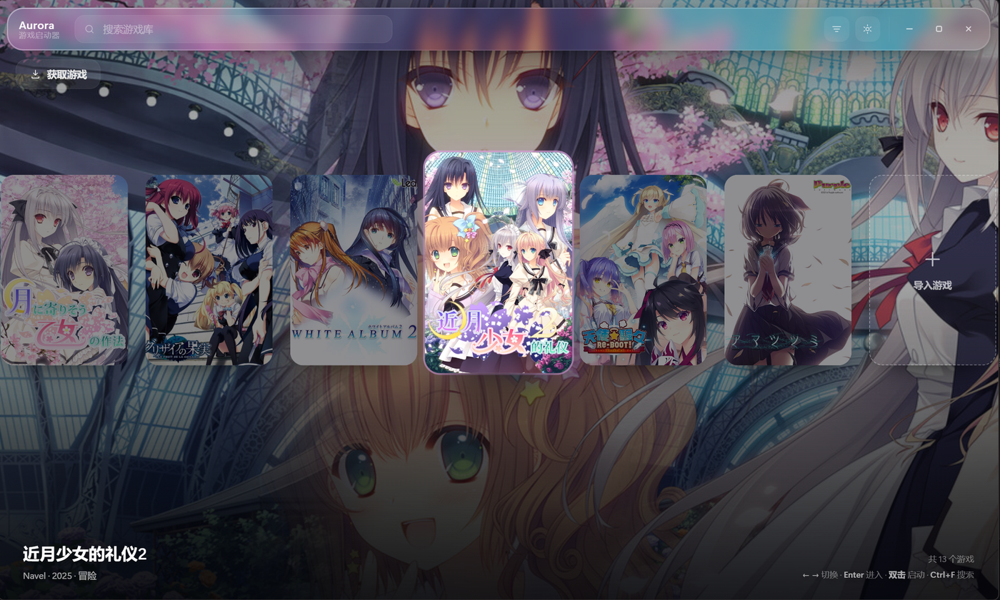

# Aurora 游戏启动器

Aurora 是一个面向 Windows 的本地游戏启动器：导入游戏后，自动匹配封面、背景、简介和标签，并提供分类整理、转区启动与游戏内翻译工具。



## 下载

从 [GitHub Releases](https://github.com/Zexuan114514/Aurora/releases) 下载最新的 `Aurora.exe`。它是免安装单文件程序，首次启动会在同目录创建 `data\`。Release 中的 Windows 程序未签名，系统可能显示“未知发布者”提示；请在运行前核对页面提供的 SHA-256。

## 适合 Aurora 的场景

- **少配置的资料匹配**：VNDB、Bangumi、Steam 多源兜底，不要求 API Key。
- **本地库管理**：环形大厅、分类页、批量整理、游玩状态和自定义封面。
- **原版游戏启动**：可调用本机已安装的 Locale Emulator 转区启动。
- **游戏内逐句翻译**：接入 Textractor 等独立钩子引擎，翻译结果显示在 Aurora 悬浮窗。
- **可扩展**：资料源、翻译引擎、引擎规则和五套主题均有对应文档。

## 翻译边界

游戏内翻译目前是**置顶悬浮窗**：译文显示在游戏画面上方的独立小窗里，默认鼠标穿透，可用 `Ctrl+Alt+T` 切换。Aurora 尚未把中文直接渲染进游戏自身文本框，也不承诺实现原生汉化效果。Textractor、Locale Emulator 等外部软件需要用户自行安装，Aurora 不打包、不下载它们。

## 文档入口

- [完整使用手册](docs/manual/README.md)：导入、匹配、分类、翻译、转区、设置和常见问题。
- [架构文档](docs/architecture/README.md)：分层、契约、ADR 和路线图。
- [引擎规则与反馈](docs/engines.md)：提交 H-code、样本文本和诊断信息。
- [插件文档](docs/plugins.md)：资料源 / 翻译引擎插件接口。
- [贡献指南](CONTRIBUTING.md)：开发环境、检查命令和许可约定。
- [变更记录](CHANGELOG.md)：公开版本的新增、改进与修复。
- [第三方参考素材说明](docs/THIRD-PARTY-ASSETS.md)：设计参考截图的来源边界。

## 从源码运行

```powershell
python main.py
# 前端改动后：
cd frontend
npm ci
npm run build
```

源码运行需要 Python 3.9+、`pywebview >= 5.0` 和 Edge WebView2 Runtime（Windows 10 缺失时可回退 Qt）。打包命令和离线检查见 [完整使用手册](docs/manual/README.md)。

## 许可证

Aurora 自有代码和文档按 [MIT License](LICENSE) 发布。第三方软件、商标、截图、图片和用户自行安装的外部工具不因该许可证获得再许可；具体边界见 [第三方参考素材说明](docs/THIRD-PARTY-ASSETS.md)。
